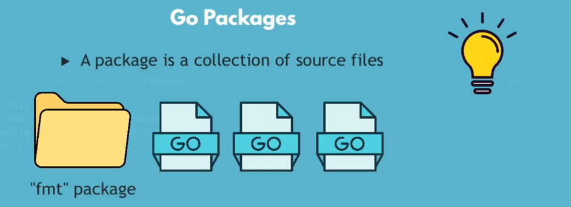

Resource: https://www.youtube.com/watch?v=yyUHQIec83I&t=102s

# core concepts
1. Data types
2. variables and constants
3. formatting and printing
4. user input
5. pointers
6. scope rules
7. loops
8. conditionals
9. functions
10. packages and modules
11. goroutines
12. concurrency

Why go was created?
1. Go was designed to run on multiple core and built in support of concurrency.
2. concurrency in Go is cheap and easy to use.

Main use case of Go
1. For very performant application which needs to be run on scaled and distributed systems.
2. For building cloud native applications.

GO is very fast and easy to learn programming language.
1. Go has simple and readable syntax of a dynamic language like Python.
2. Go provides fast and efficient performance like C/C++(low level static typed languages).
3. Go is a compiled language not an interpreted language like Python. It compiles into a single binary executable file. Hence faster than interpreted languages like Python, JavaScript etc.

# Installation
1. Installed GO
2. And install IDE
3. Go doesnt have REPL(Read Evaluate Print Loop) like Python. So we need to use IDE to run go code.
4. Installed VS code and Go extension in VS code.

# Writing first Go program
1. go mod init learning_go
2. the code must be in main package to run the code.
3. import "fmt" what is fmt? fmt is a package in Go standard library which provides functions for formatted I/O.
