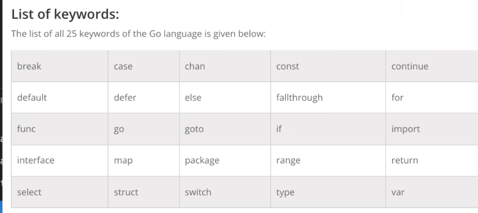
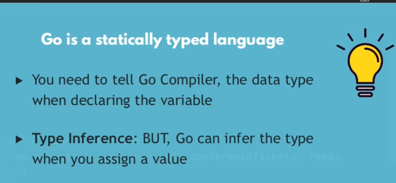

# variables and constants in GO



The variable in Go can be defined with var keyword.

```go
var name = "John Doe"
```

1. The variable in Go should be defined as camel case
2. In go if the variable is not used then it will throw an error and same go for imported packages.
3. To define the contant in Go we use const keyword.

```go
const pi = 3.14
// The value of PI cant be changes

```


4. To print the type of variable we use %T format specifier.

```go
fmt.Printf("Type of name is %T\n", name)
```

Note : the println or print will not work
To use println or print we need to import "fmt" package and use fmt.Println() or fmt.Print()

```aiignore
fmt.Println(reflect.TypeOf(conferenceName))
```

5. I can also define a variable without var keyword using := operator.

```go
name := "Gemini"
```

Here the := operator is used to define a variable without var keyword.

```This is the most "idiomatic" way to declare variables inside a function. It is concise and tells the compiler to figure out the data type automatically.

Restriction: You cannot use this outside of a function (at the package level).

Best for: Local variables, loop counters, and receiving function return values.
```

6. formatting and printing in Go


# Pointers in Go (basics)
1. The pointer is a variable that stores the memory address of another variable.
2. In Go we use & operator to get the address of a variable.
```aiignore
fmt.Println(&variableName) // prints the address of variableName
fmt.Println(&variableName)

```